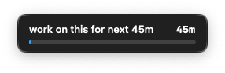

# 🫥 autohide

A macOS CLI that automatically hides app windows you're not using.

Switch to Chrome, and after 60 seconds Slack, Spotify, and everything else quietly disappear. Switch back and they're right where you left them. Your desktop stays clean without you thinking about it.

Also ships with a **floating overlay timer** for focus sessions — a small always-on-top widget that counts down while you work.

## Install

Requires Go 1.21+ and Swift 5.9+ (for the overlay).

```bash
git clone https://github.com/your-user/mac-auto-hide.git
cd mac-auto-hide
sudo make install
```

This builds both `autohide` and `autohide-overlay` into `/usr/local/bin`.

## Quick start

```bash
# Start the daemon (auto-starts on login)
autohide install

# That's it. Apps now auto-hide after 1 minute of inactivity.
```

Every command auto-starts the daemon if it isn't running, so you can also just jump straight in:

```bash
autohide status
```

## Usage

### Auto-hiding

```bash
autohide status                # check daemon state
autohide list                  # see tracked apps + time-to-hide
autohide pause                 # stop hiding (presenting, screen sharing)
autohide pause --duration 1h   # auto-resume after 1 hour
autohide resume                # resume hiding
```

### Per-app configuration

```bash
# Never hide Terminal
autohide config set-app Terminal disabled true

# Give Slack 5 minutes before hiding
autohide config set-app Slack timeout 5m

# Change the global default to 2 minutes
autohide config set default_timeout 2m

# Or just edit the file directly
autohide config edit
```

### Overlay timer

A floating countdown widget for focus sessions. Stays on top of all windows, visible on every desktop.

<p align="center">
  
</p>

```bash
autohide overlay start "API docs" 45m    # start a 45-minute session
autohide overlay pause                    # pause the countdown
autohide overlay resume                   # resume
autohide overlay hide                     # hide widget, timer keeps running
autohide overlay show                     # bring it back
autohide overlay status                   # check remaining time
autohide overlay stop                     # end session, dismiss widget
```

When the timer hits 0:00, the overlay turns red and stays visible until you `stop` or start a new session.

### Workspace labels and switching

The menu bar can show a label for the current macOS workspace so you can tell at a glance what that desktop is for.

```bash
autohide workspace current                   # show the current workspace + label
autohide workspace list                      # list workspaces on the current display
autohide workspace name "Product Strategy"  # name the current workspace
autohide workspace set 3 "BrowserOS"        # label a specific workspace
autohide workspace clear 3                  # remove a label
autohide workspace switch 3                 # jump to workspace 3
autohide workspace switch "Emails"          # jump by exact label
autohide workspace switch --fuzzy           # open the native workspace picker
```

Global shortcuts while the menu bar app is running:

- `Control+Shift+O` opens the workspace switcher
- `Hyper+O` also opens the workspace switcher
- `Hyper+N` names the current workspace

## Configuration

Config lives at `~/.config/autohide/config.toml` and is created with defaults on first run.

```toml
[general]
default_timeout = "1m"       # hide apps after this long
check_interval = "5s"        # how often to check
system_exclude = ["Finder"]  # never hide these

[apps]
  [apps.Finder]
  disabled = true

  [apps.Slack]
  timeout = "5m"

  [apps.Terminal]
  disabled = true
```

Changes take effect within 5 seconds — the daemon hot-reloads the config file.

## How it works

```
autohide (CLI)  ── unix socket ──▶  autohide daemon (background)
                                         │
                                         ├── polls frontmost app via osascript every 5s
                                         ├── hides apps that exceed their timeout
                                         └── manages overlay timer + spawns overlay widget
```

- **No cgo.** Talks to macOS through `osascript` (AppleScript via System Events).
- **No menu bar.** Pure CLI. The daemon runs via `launchd` and restarts automatically.
- **Permissions:** Requires Automation access in System Preferences > Privacy & Security for `osascript` to control app visibility.

## Daemon management

```bash
autohide install     # install launchd plist + start on login
autohide uninstall   # remove plist + stop daemon
autohide start       # start via launchd
autohide stop        # stop via launchd
autohide restart     # restart via launchd
autohide daemon      # run in foreground (for debugging)
```

Logs: `~/.config/autohide/daemon.log`

The menu bar dropdown also includes **Restart Daemon** for quickly refreshing the running app after a stuck state.

## Project structure

```
mac-auto-hide/
├── Makefile                 # builds both targets
├── autohide/                # Go CLI + daemon
│   ├── cmd/                 # cobra commands
│   ├── config/              # TOML config
│   ├── daemon/              # poll loop, tracker, overlay manager, IPC server
│   └── ipc/                 # unix socket protocol + client
└── autohide-overlay/        # Swift floating timer widget
    ├── Package.swift
    └── Sources/
```

## License

MIT
